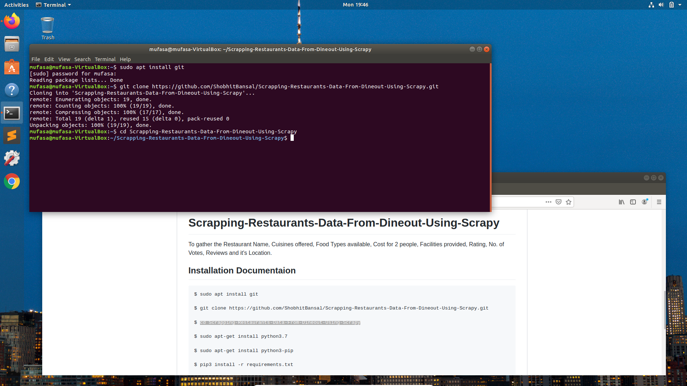
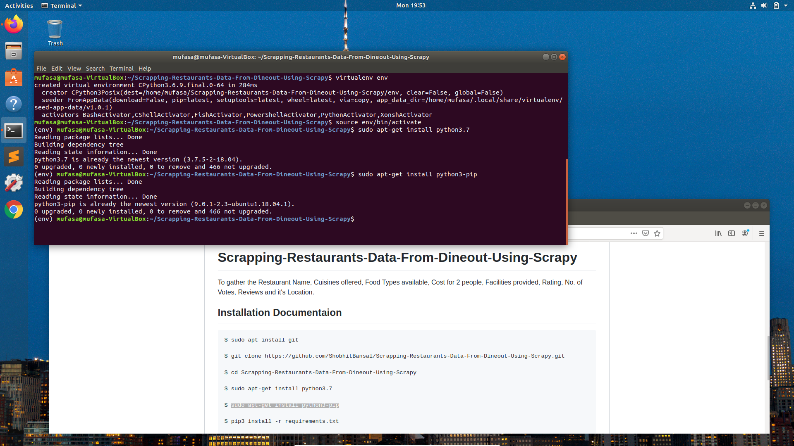
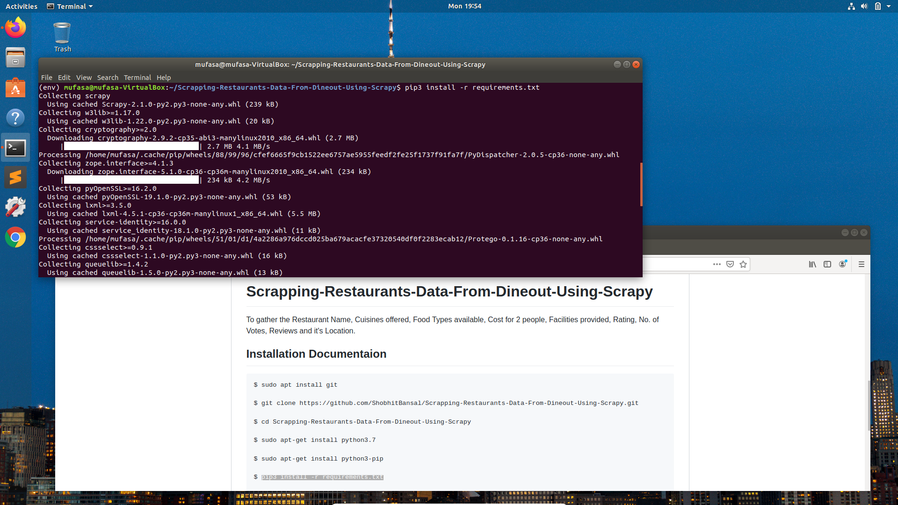
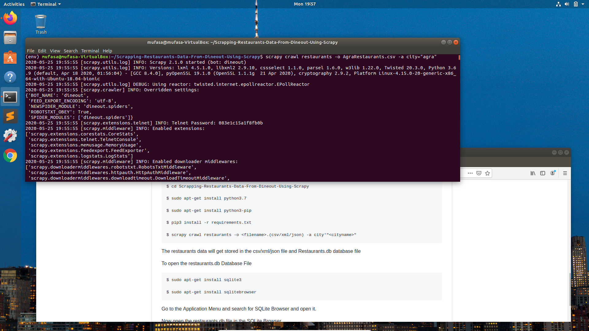
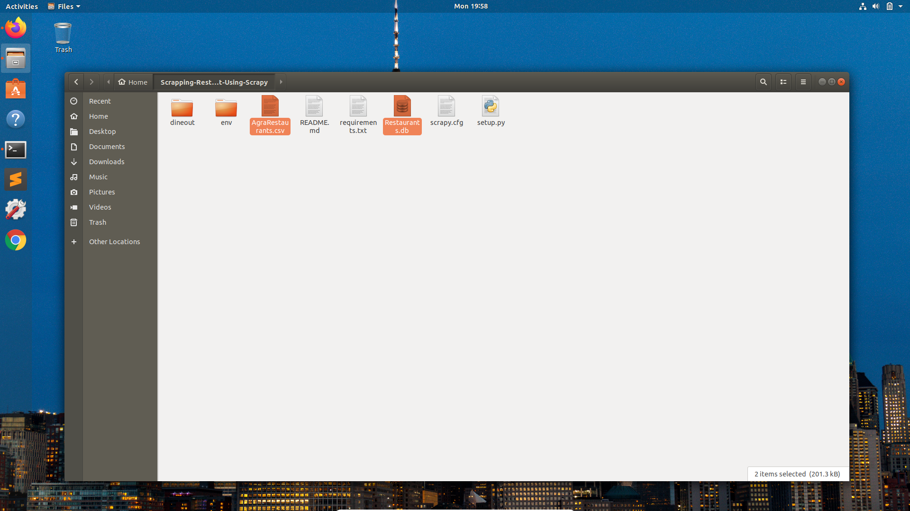
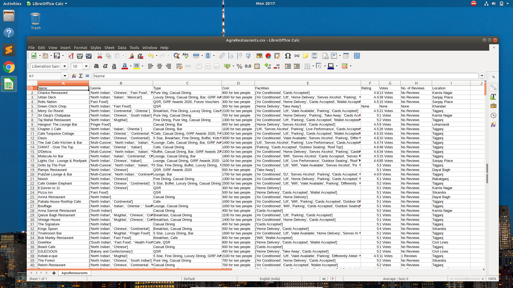
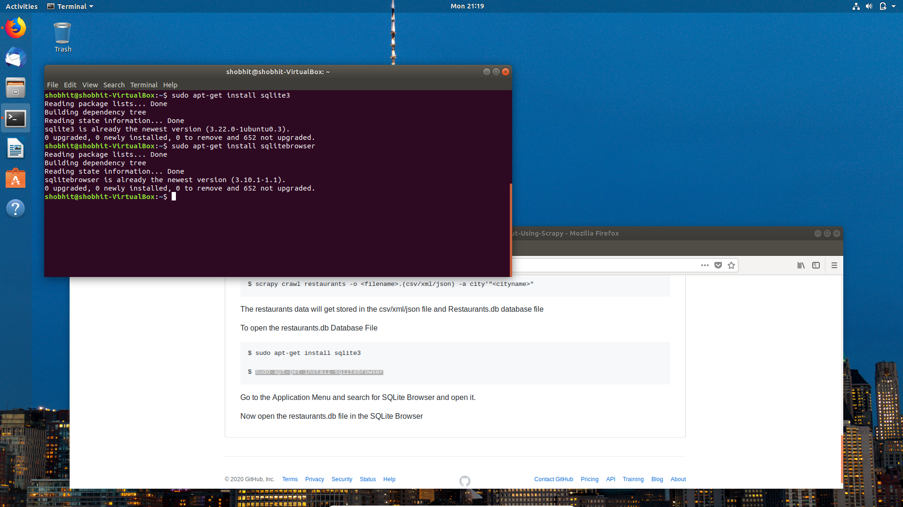
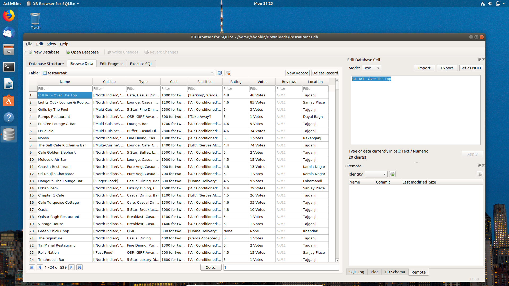

# Scrapping-Restaurants-Data-From-Dineout-Using-Scrapy

To gather the Restaurant Name, Cuisines offered, Food Types available, Cost for 2 people, Facilities provided, Rating, No. of Votes, Reviews and it's Location.

## Installation Documentaion

    $ sudo apt install git

    $ git clone https://github.com/ShobhitBansal/Scrapping-Restaurants-Data-From-Dineout-Using-Scrapy.git
  
    $ cd Scrapping-Restaurants-Data-From-Dineout-Using-Scrapy
    

    $ sudo apt-get install virtualenv
    

    $ virtualenv env

    $ source env/bin/activate
    
    $ sudo apt-get install python3.7
    
    $ sudo apt-get install python3-pip
    

    $ pip3 install -r requirements.txt
    

    
    $ scrapy crawl restaurants -o <filename>.(csv/xml/json) -a city'"<cityname>"
    

    
The restaurants data will get stored in the csv/xml/json file and Restaurants.db database file

Open the csv file in LibreOffice

    
To open the restaurants.db Database File 
    
    $ sudo apt-get install sqlite3
    
    $ sudo apt-get install sqlitebrowser
    

Now open the restaurants.db file in the SQLite Browser

